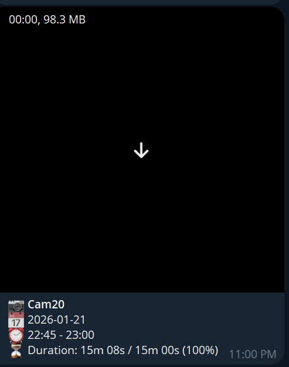
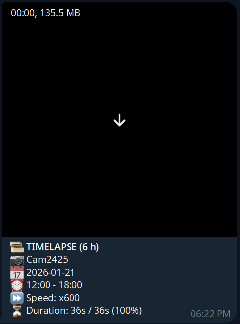
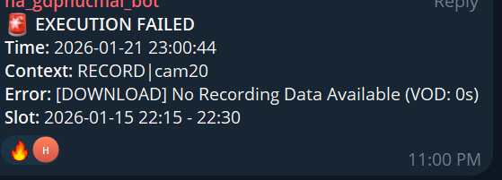
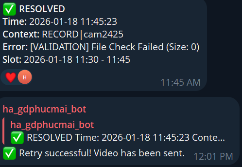

# Frigate Telegram Record

A lightweight containerized service that automatically downloads video clips from your Frigate NVR and sends them to Telegram. The service intelligently manages recording history to prevent duplicates, validates video quality, and provides error notifications. Additionally, a web dashboard is available for monitoring statistics and recording history.

## ✨ Features

- **Automated Video Recording**: Periodically checks Frigate for missing time slots and downloads corresponding clips
- **Dual Operating Modes**: 
  - `record` mode: Sends regular video clips at configurable intervals
  - `timelapse` mode: Creates time-compressed videos from HLS streams
- **Smart Duplicate Prevention**: Uses SQLite database to track sent videos and avoid duplicates
- **Video Validation**: Verifies clip size, MIME type, and duration before sending
- **Intelligent Error Handling**: 
  - Retry mechanism with exponential backoff for Telegram rate limits
  - Error notifications to designated Telegram chat
  - Automatic recovery notifications when previously failed recordings succeed
- **Multi-Camera Support**: Configure multiple cameras with individual Telegram destinations
- **Topic/Thread Support**: Send videos to specific forum topics in Telegram groups
- **Hardware Acceleration**: VAAPI support for efficient timelapse generation
- **Web Dashboard**: A user-friendly interface for monitoring camera statistics and recording history

## 🔍 How It Works?

The service operates on a time-slot based system:

1. **Time Division**: Divides time into configurable slots (e.g., 15 minutes per slot)
2. **Gap Detection**: Checks the SQLite database to find missing/unsent time slots
3. **Clip Download**: Requests clips from Frigate using the API endpoint:
   ```
   /api/<camera>/start/<start_ts>/end/<end_ts>/clip.mp4
   ```
4. **Validation**: Verifies the downloaded clip meets quality criteria
5. **Telegram Delivery**: Sends validated clips to configured Telegram chats/threads
6. **History Tracking**: Records successful sends in the `sent_ranges` table and failures in `alert_history`

## 📦 Prerequisites

Before you begin, ensure you have:

1. **Frigate NVR**: A running Frigate instance with configured cameras
2. **Telegram Bot**: 
   - Create a bot via [@BotFather](https://t.me/BotFather) and obtain the bot token
   - Add the bot to your target chat/group
   - Get your chat ID (use [@userinfobot](https://t.me/userinfobot) or check Telegram group settings)
3. **Docker**: Docker and Docker Compose installed on your system
4. **(Optional) Hardware Acceleration**: For timelapse mode, ensure `/dev/dri/renderD128` is accessible

## 🚀 Quick Start

### Method 1: Using Docker Compose (Recommended)

1. **Clone or download this repository**:
   ```bash
   git clone https://github.com/SilverKnightKMA/frigate-telegram-record.git
   cd frigate-telegram-record
   ```

2. **Create your configuration file**:
   ```bash
   cp config.env.example config.env
   ```

3. **Edit `config.env` with your settings**:
   - `BOT_TOKEN`: Your Telegram bot token
   - `FRIGATE_HOST`: Your Frigate server URL
   - `CAMERAS`: Camera configurations

4. **Review and customize** `docker-compose.yml` if needed

5. **Start the service**:
   ```bash
   docker-compose up -d
   ```

6. **Check the logs**:
   ```bash
   docker-compose logs -f
   ```

### Method 2: Using Docker Run

Build and run manually:

```bash
# Build the image
docker build -t frigate-telegram-record .

# Run the container
docker run -d \
  --name frigate-telegram-record \
  -v $(pwd)/data:/app/data \
  -e BOT_TOKEN=your_telegram_bot_token_here \
  -e CAMERAS=Readable_name|camera_id|thread_id|chat_id \
  -e FRIGATE_HOST=http://192.168.1.x:5000 \
  frigate-telegram-record
```

## ⚙️ Configuration

### Essential Environment Variables

| Variable | Description | Example | Required |
|----------|-------------|---------|----------|
| `BOT_TOKEN` | Telegram bot token from @BotFather | `123456789:ABCdef...` | ✅ Yes |
| `CAMERAS` | Camera configurations (see format below) | `Front\|front_door\|2\|-100123` | ✅ Yes |
| `FRIGATE_HOST` | Frigate server URL | `http://192.168.1.100:5000` | ✅ Yes |
| `ERROR_CHAT_ID` | Chat ID for error notifications | `-1001234567890` | ✅ Yes |
| `MODE` | Operating mode | `record` or `timelapse` | No (default: `record`) |

### Camera Configuration Format

The `CAMERAS` variable uses a specific format to configure multiple cameras:

```
DisplayName|frigate_camera_name|thread_id|chat_id
```

- **DisplayName**: Human-readable name shown in Telegram
- **frigate_camera_name**: Camera name as configured in Frigate
- **thread_id**: Topic/thread ID in Telegram (leave empty if not using topics)
- **chat_id**: Telegram chat ID where videos will be sent

**Multiple cameras** are separated by semicolons (`;`):

```bash
CAMERAS=Front Door|front_door|2|-1001234567890;Back Yard|back_yard|3|-1001234567890;Garage|garage||-1009876543210
```

### Additional Configuration Options

For a complete list of available configuration options, see [config.env.example](config.env.example). Key options include:

- **Recording Settings**:
  - `REC_DURATION_MIN`: Duration of each clip in minutes (default: 15)
  - `MIN_DURATION_PERCENT`: Minimum valid duration percentage (default: 90)

- **Timelapse Settings**:
  - `TIMELAPSE_HOURS`: Duration of each timelapse block (default: 6)
  - `TIMELAPSE_QUALITY`: Encoding quality (default: 24, lower = better)

- **Notification Settings**:
  - `NOTIFY_ON_RECOVERY`: Send recovery notifications (default: true)
  - `ALERT_REPEAT`: Resend alerts for same time slot (default: false)

- **Performance Tuning**:
  - `MAX_CONCURRENT_TASKS`: Maximum parallel operations (default: 2)
  - `RETENTION_DAYS`: Database record retention (default: 30)

## 🎮 Operating Modes

### Record Mode (Default)

Continuously monitors Frigate and sends video clips at regular intervals.

```bash
MODE=record
REC_DURATION_MIN=15  # Send 15-minute clips
```

### Timelapse Mode

Creates time-compressed videos from HLS streams.

```bash
MODE=timelapse
TIMELAPSE_HOURS=6     # 6 hours of footage
TIMELAPSE_SPEED=60    # 60x speed (1 hour = 1 minute)
```

### Test Modes

Run a single cycle and exit (useful for testing configuration):

- `MODE=test`: Test record mode
- `MODE=test_timelapse`: Test timelapse mode

## 🖥️ Web Dashboard

The web dashboard provides a user-friendly interface for monitoring camera statistics and recording history.

### Features

- Overview of total cameras, successful recordings, timelapse videos, and errors
- Detailed statistics per camera
- Recent activity logs
- Interactive charts for storage trends, error distribution, and more

### Quick Start

1. Ensure the `frigate-web-dashboard` service is included in your `docker-compose.yml`:
   ```yaml
   frigate-web-dashboard:
     image: ghcr.io/silverknightkma/frigate-telegram-record-web:1.1.5
     container_name: frigate-web-dashboard
     restart: unless-stopped
     ports:
       - "8080:8080"
     volumes:
       - ./data:/app/data:ro
     environment:
       - DB_FILE=/app/data/video_history.sqlite
       - WEB_PORT=8080
   ```

2. Access the dashboard at `http://localhost:8080`.

For more details, see the [web dashboard README](web/README.md).

### Screenshots









## 🔧 Advanced Usage

### Running Both Record and Timelapse

You can run both modes simultaneously by using two separate containers. See the example in `docker-compose.yml`:

```bash
docker-compose up -d frigate-telegram-record frigate-telegram-timelapse
```

### Using Hardware Acceleration

For timelapse mode with Intel GPU acceleration:

1. Ensure your user has access to the GPU device:
   ```bash
   sudo usermod -aG video $(whoami)
   ```

2. Add device mapping in `docker-compose.yml` (already included in the example).

### Custom Telegram API Server

If you're using a local Telegram Bot API server:

```bash
TELEGRAM_API_URL=http://your-local-api-server:8081
```

---

## 🖥️ Running Locally (without Docker) ⚙️

You can run the service directly on a host (Linux or WSL). Requirements include: `bash`, `ffmpeg`, `file`, `sqlite` (or `sqlite3`), `jq`, `coreutils`, and `tzdata`. Example steps (Debian/Ubuntu):

```bash
sudo apt update && sudo apt install -y bash ffmpeg file sqlite3 jq coreutils ca-certificates tzdata
git clone https://github.com/SilverKnightKMA/frigate-telegram-record.git
cd frigate-telegram-record
cp config.env.example config.env   # or place your file at ./config/config.env
mkdir -p ./data
# Edit config.env or set env vars (BOT_TOKEN, FRIGATE_HOST, CAMERAS, etc.)
MODE=record BOT_TOKEN=... FRIGATE_HOST=http://<frigate-host>:5000 ./app.sh
# For a single test cycle
MODE=test ./app.sh
```

Notes:
- The app will use `./data` (or `/app/data` inside a container) for the database, logs, and temporary files. Ensure it is writable.
- The Docker `HEALTHCHECK` inspects `/app/data/.heartbeat`. When running locally, ensure the service can create/update a `.heartbeat` file in the data directory.

For running the web dashboard locally, see `web/README.md`. Install Python dependencies with `pip install -r web/requirements.txt`, set `DB_FILE` and run `python web_dashboard.py`.

## 🧩 Docker build & hardware acceleration notes

- The `Dockerfile` installs an Intel media driver only when building for the `amd64` architecture (via the `TARGETARCH` build-arg). If you need VAAPI acceleration, build/run on `amd64` and map `/dev/dri/renderD128` into the container.

Build example:

```bash
docker build --build-arg TARGETARCH=$(uname -m) -t frigate-telegram-record:local .
```

## 🧾 License

This project is released under the **MIT License**. See the `LICENSE` file for details.
