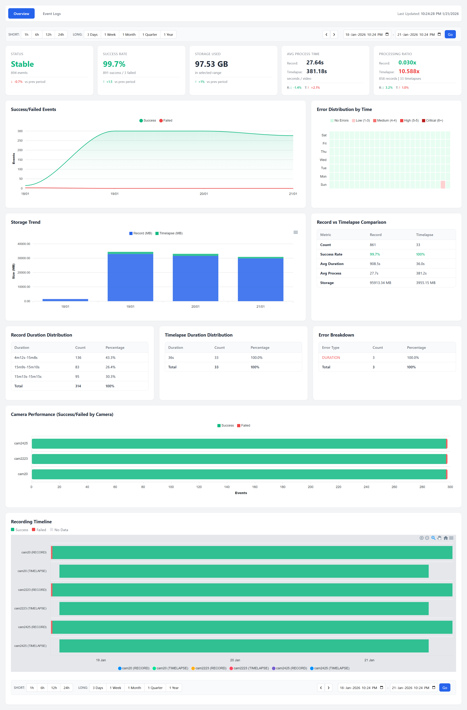
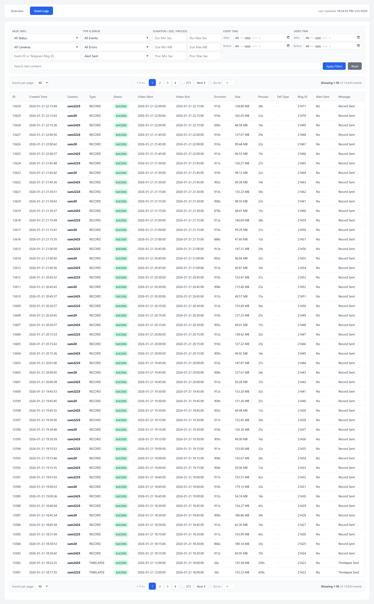

# Frigate Record Web Dashboard

A lightweight Flask-based web dashboard for inspecting camera statistics and recording history collected in the `video_history.sqlite` database.

---

## Quick Start (Docker)

Start the dashboard service from the repository root using Docker Compose:

```bash
docker-compose up -d frigate-web-dashboard
```

- The service in `docker-compose.yml` is called `frigate-web-dashboard` and maps port `8080` by default.
- The container expects the database file at `/app/data/video_history.sqlite` (set via `DB_FILE` environment variable). In `docker-compose.yml` the `./data` folder is mounted into the container as read-only for the web service (`./data:/app/data:ro`). Make sure the file exists and is readable by the container.

### Access

Open your browser at: `http://localhost:8080` (or `http://<host>:<WEB_PORT>` if you change the port).

### Screenshots





---

## Run Standalone (Without Docker)

1. Install dependencies:

```bash
pip install -r requirements.txt
```

2. Set the database location and run the app.

Linux / macOS:

```bash
export DB_FILE=./data/video_history.sqlite
python web_dashboard.py
```

Windows (PowerShell):

```powershell
$env:DB_FILE = ".\data\video_history.sqlite"
python web_dashboard.py
```

Windows (cmd.exe):

```cmd
set DB_FILE=.\data\video_history.sqlite
python web_dashboard.py
```

The app uses `WEB_PORT` (default `8080`) to set the listening port.

---

## Features

- Overview statistics (totals, success rate, storage, average processing time)
- Timeline charts and storage trend over selectable ranges
- Duration distribution for Record vs Timelapse
- Error reason breakdown and camera performance
- Event logs with filters and paging
- Multiple API endpoints for programmatic access (see below)

---

## API Endpoints (selected)

- `GET /api/overview` — high level metrics and daily chart data
- `GET /api/timeline_stats?start=<ts>&end=<ts>` — stats for a time range (used by Overview/Timeline)
- `GET /api/timeline?start=<ts>&end=<ts>` — raw timeline events for the selected range
- `GET /api/duration_distribution?start=<ts>&end=<ts>` — histogram of durations
- `GET /api/processing_efficiency?start=<ts>&end=<ts>` — process_time / duration ratios
- `GET /api/trend_comparison?start=<ts>&end=<ts>` — compare current vs previous period
- `GET /api/logs` — paginated event logs for the UI
- `GET /api/filters` — metadata lists used for filters (cameras, types, errors)

(Endpoints are implemented in `web_dashboard.py`.)

---

## Configuration & Environment Variables

- `DB_FILE` — path to the SQLite DB file (default: `/app/data/video_history.sqlite`)
- `WEB_PORT` — port to bind the web server (default: `8080`)
- `TZ` — timezone for display (default: `Asia/Ho_Chi_Minh`)

Notes:
- The web app opens the SQLite DB in read-only mode. If the DB file is missing or permissions prevent access, the app will return a "Database connect failed" response and the server logs will include diagnostic messages from `web/common.py`.

## Database Schema

The dashboard reads the SQLite database at `DB_FILE` and expects an `events` table with the following columns (at minimum):

- `id` (INTEGER) — unique event id
- `camera` (TEXT) — camera identifier
- `type` (TEXT) — 'record' or contains 'timelapse'
- `status` (TEXT) — 'SUCCESS' or 'FAILED'
- `created_at` (REAL/INTEGER) — unix timestamp for event creation
- `start_ts`, `end_ts` (REAL/INTEGER) — unix timestamps for video start/end
- `duration` (REAL) — video duration in seconds
- `filesize` (INTEGER) — file size in bytes
- `process_sec` (REAL) — processing time in seconds
- `fail_type` (TEXT) — failure reason
- `message` (TEXT) — base64 encoded message (decoded by dashboard)
- `search_text` (TEXT) — precomputed short message for display
- `msg_id` (INTEGER) — Telegram message id (optional)
- `alert_sent` (INTEGER/BOOLEAN) — whether alert was sent (optional)

---

## Troubleshooting

- "Database connect failed": verify `DB_FILE` is correct and the file exists, check permissions, and ensure the Docker volume mapping exposes the DB file to the web container.
- If the web UI appears blank or assets won't load, confirm the container is running and the port is exposed in `docker-compose.yml`.
- To get more diagnostic information, check container logs (e.g. `docker logs frigate-web-dashboard`) or start the app locally to see `stderr` diagnostics from `common.diagnose_db_issues()`.

---

## Notes / Implementation Details

- The frontend periodically updates its "Last Updated" timestamp every 60 seconds (implemented in `static/js/dashboard.js`). The timeline charts load on user interaction (range selection) and are not automatically refreshed more frequently by default.
- The dashboard serves static assets from `/static/` and templates from `templates/`.

---

## Dependencies

Tested with Python 3.9+.

Contents of `requirements.txt`:

```
Flask==3.1.2
pytz==2025.2
```

---

## Contributing

Bug reports, documentation fixes, and pull requests are welcome.

---

*If any behavior here is out of date, please open an issue or submit a PR to update documentation.*
